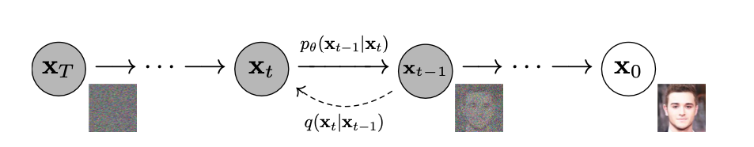
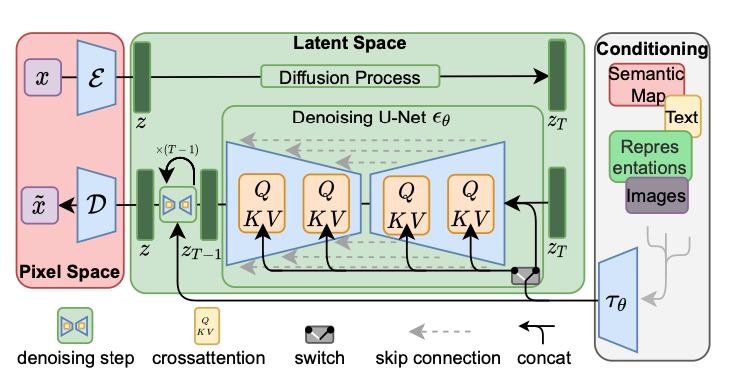
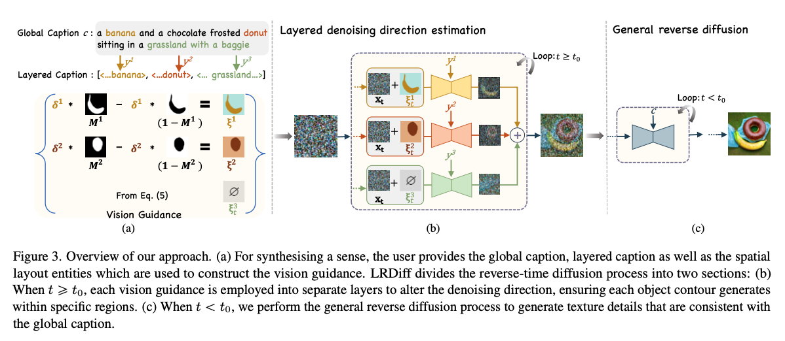
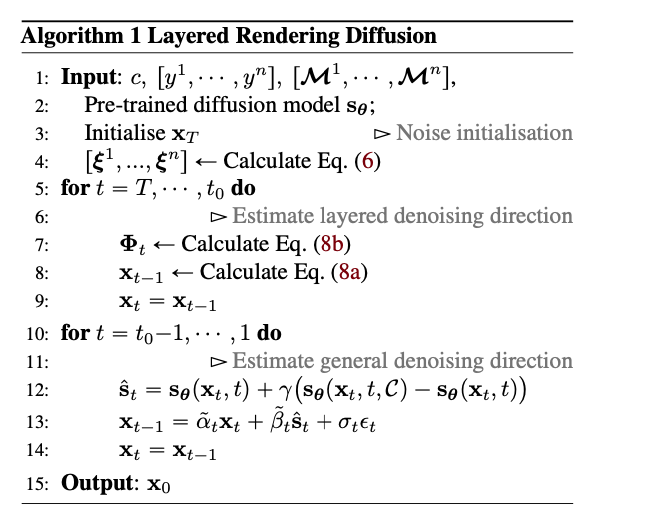

# Layered Rendering Diffusion Model
Unofficial implementation of the paper "Layered Rendering Diffusion Model for Zero-Shot Guided Image Synthesis". 

You can find the implementation in this Colab notebook, modify the stable diffuse model from huggingface:
<a href="https://drive.google.com/file/d/1KcNvrjh7k5G4FFbzeMfdGruA-o0Y4XZB/view?usp=share_link">layer rendering diffusion model </a>

## Objective of the Model
Control the layout of the images generated from difffuse model, ***without retraining or fine tunning*** and make better sementic alignment.

## Evaluation Matrix
CLIP score and T2I-Sim: text image sementic alignment
IOU: layout overlay
AP: generate right class

## Evaluation Dataset
1134 captions with objects, with bonding box or masks.

## Diffuse Model
The diffuse model consists of two distinct processes: forward and reverse (generation). Understanding the diffuse process from the physical perspective reveals that the forward process mimics the diffusion of pollen particles in water. During this phase, the diffuse model consistently introduces random noise into the system. In contrast, the reverse (generation) process is designed to entirely reverse the diffusion process, allowing for the collection of pollen. This reversal entails retracing the movements or distribution of diffusing particles in the opposite direction, ultimately restoring the initial configuration.

<figure>
  
  <figcaption>Figure 1. The directed graphical model of DDPM (Ho et al., 2020). </figcaption>
</figure>

## Latent Diffuse Model
Latent diffuse model can further reduced the time of forward and reverse process though performing the diffuse in the latent space without reducing the synthesis quality (Rombach et al., 2022). The architecture of latent diffuse model is shown in Figure 2. The latent diffuse model include two stages, the first stage contains a VAE (Razavi et al., 2019) or VQGAN  (Esser et al., 2021) model. The encoder \\(\varepsilon\\) encoded \\(x\\) into the latent space \\(z\\), the decoder \\(D\\) decode \\(z\\) into the image space. In the second stage, forward and reverse diffusion happens in the latent space \\(z\\),  hence reducing the training and inference time. The conditions are added to the diffusion model after embedded using encoder \\(\tau_{\theta}\\), the encoded conditions are query in the cross-attention layers of the modified Unet \\(\epsilon_{\theta}\\) model.

<figure>
  
  <figcaption>Figure 2. The architecture of latent diffuse model (Rombach et al.,2022) </figcaption>
</figure>

## Layered Rendering Diffusion Model
<figure>
  
</figure>
The algorithm of layer rendering model is shown below:
<figure>
  
</figure>

## Unoffical Implementation
Since the paper did not published the implementation. Here I implement the paper without strickly following the algorithm, because the model description part is confusing. Therefore, this implementation take the essense of the algorithms that add the vision guidance to the noize image in the latent space. The current implementation following the steps below:
1. only modify the "up_attention" module in the Unet, select the attension map with topk intensities, and go through a single sampling step, and generate the vision guidance by weight the layout with attention map.
2. the weighted mask is then been added to the random noise for image generation.
3. the following algorithm excatelly follows the algorithm shown above.

## Result of this Implementation
This is the image generated in the <a href="https://drive.google.com/file/d/1KcNvrjh7k5G4FFbzeMfdGruA-o0Y4XZB/view?usp=share_link">layer rendering diffusion model colab </a>
<figure>
  
</figure>

